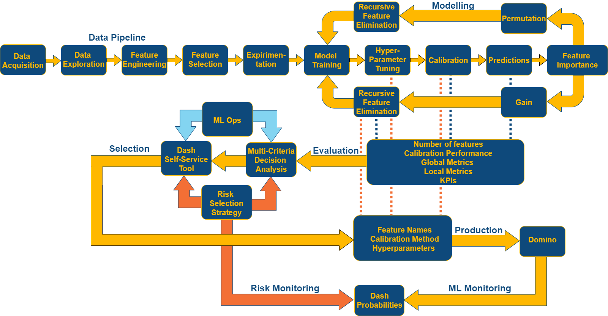
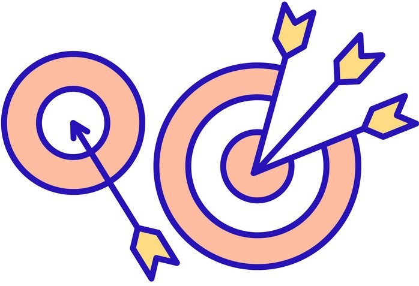
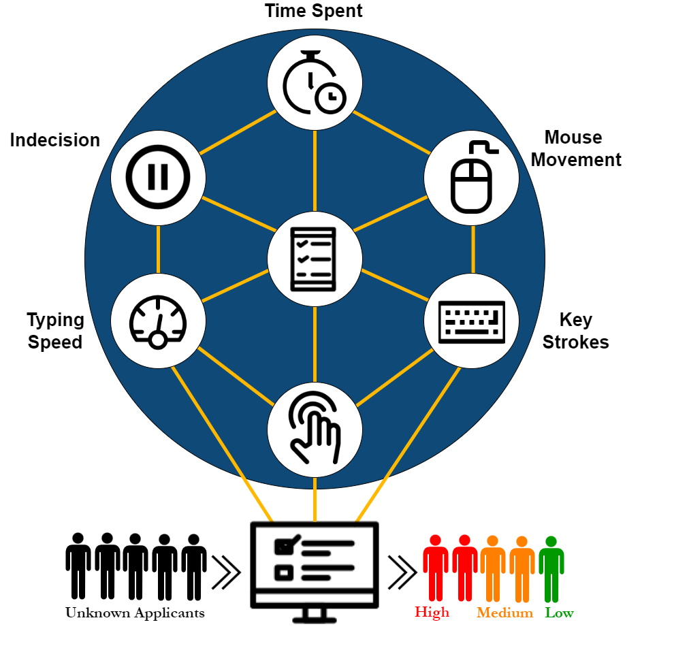
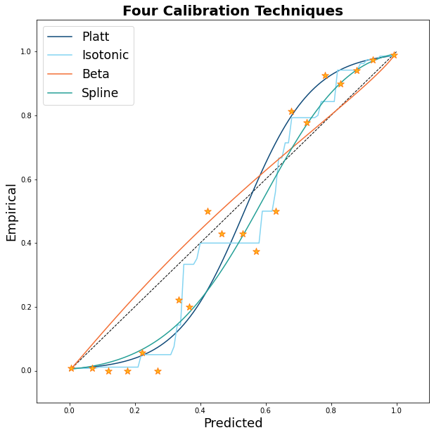
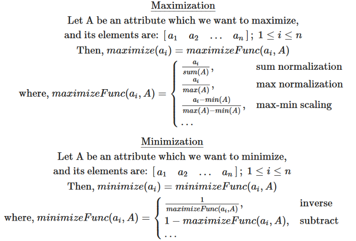
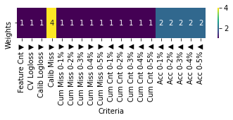

```{r setup, include=FALSE}
options(
  htmltools.dir.version  = FALSE,
  htmltools.preserve.raw = FALSE 
)
```

# Presentation Roadmap
- **Confidence Team** _(2 minutes)_
- **Confidence Background** _(2 minutes)_
- **Confidence Architecture** _(2 minutes)_
- **Data Pipeline**
  - Acquisition & Exploration _(2 minutes)_
  - Feature Engineering _(2 minutes)_
  - Feature Selection _(2 minutes)_
  - Pipeline Snapshot _(2 minutes)_
- **Experimentation** _(2 minutes)_
- **Modeling**
  - Experimentation _(2 minutes)_
  - Hyperparameter Tuning _(2 minutes)_
  - Probability Calibration _(2 minutes)_
- **Evaluation**
  - Multi-Criteria Decision Analysis _(2 minutes)_
- **Monitoring**
  - Probability-Based Classification Monitoring _(2 minutes)_
- **Summary**
  - Concluding Remarks _(2 minutes)_
- **Q & A**
  
```{r, warning=FALSE, echo=FALSE, message=FALSE}
suppressWarnings(suppressMessages(library(countdown)))
countdown(minutes   = 2, 
          seconds   = 0, 
          left      = 0, 
          margin    = "1%", 
          font_size = "1em", 
          warn_when = 10)
```

---

.pull-left[

## Confidence Team

Justin Kurland, Lead Data Scientist
```{r, echo=F,  out.width="25%", out.height="25%"}
suppressWarnings(suppressMessages(library(knitr)))


```

Aamodini Gupta, Sr Data Scientist
```{r, echo=F,  out.width="25%", out.height="25%"}
suppressWarnings(suppressMessages(library(knitr)))


```

Nathan Rickert, Assoc Data Scientist
```{r, echo=F,  out.width="25%", out.height="25%"}
suppressWarnings(suppressMessages(library(knitr)))


```
]

.pull-right[
# 

```{r, out.width="100%", out.height=="40%", warning=FALSE, echo=FALSE, message=FALSE}
suppressWarnings(suppressMessages(library(countdown)))
suppressWarnings(suppressMessages(library(leaflet)))
suppressWarnings(suppressMessages(library(tidyverse)))

homes_tbl <- read_csv("homes.csv", col_types = cols())

getColor <- function(homes_tbl) {
  sapply(homes_tbl$ID, function(ID) {
  if(ID <= 6) {
    "red"
  } else if(ID > 7 & ID < 12) {
    "blue"
  } else {
    "green"
  } })
}

icons <- awesomeIcons(
  icon      = 'ios-close',
  iconColor = 'black',
  library   = 'ion',
  markerColor = getColor(homes_tbl)
)

leaflet(data = homes_tbl) %>% 
  setView(lng=-87.90, lat=43.03, zoom = 2) %>%
  addProviderTiles(providers$Stamen.Watercolor) %>%
  addAwesomeMarkers(~long, ~lat, icon=icons, label=~as.character(location))
  
countdown(minutes   = 2, 
          seconds   = 0, 
          left      = 0, 
          margin    = "1%", 
          font_size = "1em", 
          warn_when = 10)
```
]

---

# Confidence Background

- Accelerate underwriting

- Improve customer experience

- Save $

- Minimize risk

- Establish the 'ground truth'

- Online Medical Health Questionnaire

```{r, warning=FALSE, echo=FALSE, message=FALSE}
suppressWarnings(suppressMessages(library(countdown)))
countdown(minutes   = 2, 
          seconds   = 0, 
          left      = 0, 
          margin    = "1%", 
          font_size = "1em", 
          warn_when = 10)
```


---
# Confidence Architecture

```{r, echo=F}
suppressWarnings(suppressMessages(library(knitr)))
suppressWarnings(suppressMessages(library(countdown)))


countdown(minutes   = 2, 
          seconds   = 0, 
          left      = 0, 
          margin    = "1%", 
          font_size = "1em", 
          warn_when = 10)
```

---
.pull-left[
## Data Aquisition
```{r, echo=F, out.width="100%", out.height="20%", warning=FALSE, message=FALSE}
suppressWarnings(suppressMessages(library(knitr)))


```

- Clickstream data
- Daily delivery

```{r, echo=F, out.width="100%", out.height="20%", warning=FALSE, message=FALSE}
suppressWarnings(suppressMessages(library(countdown)))
suppressWarnings(suppressMessages(library(knitr)))


countdown(minutes   = 2, 
          seconds   = 0, 
          left      = 0, 
          margin    = "1%", 
          font_size = "1em", 
          warn_when = 10)
```
- Netezza
- General applicant data
]

.pull-right[
## Data Exploration 
- One to One
```{r, echo=F, out.width="100%", out.height="20%", warning=FALSE, message=FALSE}
suppressWarnings(suppressMessages(library(knitr)))

```
- One to Many
```{r, echo=F, out.width="100%", out.height="20%", warning=FALSE, message=FALSE}
suppressWarnings(suppressMessages(library(knitr)))

```
- Impairment Mismatch
```{r, echo=F, out.width="60%", out.height="10%", warning=FALSE, message=FALSE}
suppressWarnings(suppressMessages(library(knitr)))

```
- Exploratory Data Analysis
```{r, echo=F, out.width="80%", out.height="20%", warning=FALSE, message=FALSE}
suppressWarnings(suppressMessages(library(knitr)))

```
]

---

.pull-left[
## Behavioural Features    
```{r, echo=F,  out.width="100%", out.height="100%"}
suppressWarnings(suppressMessages(library(countdown)))
suppressWarnings(suppressMessages(library(knitr)))


countdown(minutes   = 2, 
          seconds   = 0, 
          left      = 0, 
          margin    = "1%", 
          font_size = "1em", 
          warn_when = 10)
```
]

.pull-right[
## Time Spent Deviation Flag
```{r, echo=F,  out.width="100%", out.height="100%"}
suppressWarnings(suppressMessages(library(tidyverse)))
suppressWarnings(suppressMessages(library(plotly)))
suppressWarnings(suppressMessages(library(widgetframe)))

set.seed(501) 
x <- as.vector(rnorm(10000, mean=15))
d <- as.data.frame(x=x)


p <- suppressWarnings(ggplot(data=d) +
     theme_bw() + 
     geom_density(aes(x=x, y = ..density..), color = '#0E497B'))

q15.9   <- quantile(x, .159) 
q84.1   <- quantile(x, .841)
q2.3    <- quantile(x, .023) 
q97.7   <- quantile(x, .977)
q0.01   <- quantile(x, .001) 
q99.9   <- quantile(x, .999)
meanx   <- mean(x)
medx    <- median(x)
x.dens  <- density(x)
df.dens <- data.frame(x=x.dens$x, y=x.dens$y)

df.dens <- df.dens %>% 
  mutate(type = case_when(
  x >= q15.9 & x <= q84.1 ~ "1 Stardard Deviation",
  x >= q2.3  & x <= q97.7 ~ "2 Standard Deviations",
  x >= q0.01 & x <= q99.9 ~ "3 Standard Deviations",
  x >  q99.9 ~"Greater than 3 Standard Deviations",
  TRUE ~ as.character(x)
))


fig <-  suppressWarnings(p + geom_area(data = subset(df.dens, x >= q15.9 & x <= q84.1), 
              aes(x=x,y=y, text=type), fill='#0E497B', alpha=0.8) +
    geom_area(data = subset(df.dens, x >= q2.3 & x <= q97.7), 
              aes(x=x,y=y, text=type), fill='#0E497B', alpha=0.6) +
    geom_area(data = subset(df.dens, x >= q0.01 & x <= q99.9),
              aes(x=x,y=y, text=type), fill='#0E497B', alpha=0.4) +
    geom_area(data = subset(df.dens, x > q99.9),
              aes(x=x,y=y, text=type), fill='#0E497B', alpha=0.2) +
    geom_vline(xintercept=meanx, color='#FFFFFF') +
      labs(
        y        = 'Density',
        x        = 'Time (seconds)') +
    theme_bw())

fig <- suppressWarnings(ggplotly(fig, tooltip = 'text'))

frameWidget(fig, width='100%', height='100%')

```
]

---

# Temporal Features
```{r, echo=F,  out.width="100%", out.height="80%"}
suppressWarnings(suppressMessages(library(tidyverse)))
suppressWarnings(suppressMessages(library(lubridate)))
suppressWarnings(suppressMessages(library(timetk)))
misrep_tbl <- read_csv("misrep_season.csv", col_types = cols())

misrep_tbl <- misrep_tbl %>%
  mutate(date = mdy_hms(date)) %>%
  summarise_by_time(
        .date_var = date,
        .by       = "day",
        value     = sum(Misrep)) %>%
  ungroup()

fig <- misrep_tbl %>%
  plot_seasonal_diagnostics(date, 
                            value, 
                            .geom_color         = "#0E497B", 
                            .geom_outlier_color = "#0E497B", 
                            .title              = "",
                            .interactive        = T)

frameWidget(fig, width='100%', height='80%')

countdown(minutes   = 2, 
          seconds   = 0, 
          left      = 0, 
          margin    = "1%", 
          font_size = "1em", 
          warn_when = 10)

```

---

.pull-left[
## Unsupervised Feature Selection
### Train

- Duplicates

- Constant and quasi-constants

- Multicollinearity


```{r, echo=F}
suppressWarnings(suppressMessages(library(countdown)))
countdown(minutes   = 2, 
          seconds   = 0, 
          left      = 0, 
          margin    = "1%", 
          font_size = "1em", 
          warn_when = 10)

```
]

.pull-right[
## Supervised Feature Selection

### CV Folds

- Boruta + XGBoost

  - All-relevant feature selection method
  
  - Traditionally a wrapper algorithm around Random Forest
  
  - Shuffles features (shadow features)
  
  - Trains RF on extended dataset & evaluates feature importance (real Z-score v shadow Z-score)
]

---

# Pipeline Snapshot
```{r, out.width="100%", out.height="70%", echo=F}
suppressWarnings(suppressMessages(library(countdown)))
suppressWarnings(suppressMessages(library(plotly)))
suppressWarnings(suppressMessages(library(widgetframe)))

fig <- plot_ly(
    type = "funnel",
    name = 'Numeric',
    y = c("Connection", "Pre-Processing", "Feature Engineering",  "Train/Test Split", "Encoding", "Unsupervised Feature Selection","Supervised Feature Selection"),
    x = c(190, 187, 226, 162, 162, 56, 9),
    textinfo = "value",
    marker = list(color = c("#0E4978"), line = list(width = c(1), color = c("#FFFFFF"))))
fig <- fig %>%
  add_trace(
    type = "funnel",
    name = 'Categorical',
    orientation = "h",
    y = c("Connection", "Pre-Processing", "Feature Engineering",  "Train/Test Split", "Encoding", "Unsupervised Feature Selection","Supervised Feature Selection"),
    x = c(260, 255, 300, 295, 145,  90,  0),
    textposition = "inside",
    textinfo = "value",
    marker = list(color = c("#FFB81C"), line = list(width = c(1), color = c("#FFFFFF"))))
fig <- fig %>%
  add_trace(
    type = "funnel",
    name = 'Datetime',
    orientation = "h",
    y = c("Connection", "Pre-Processing", "Feature Engineering",  "Train/Test Split", "Encoding", "Unsupervised Feature Selection","Supervised Feature Selection"),
  x = c(17,  5,   118, 118, 110,  37, 21),
  textposition = "inside",
  textinfo = "value",
  marker = list(color = c("#83D4F1"), line = list(width = c(1), color = c("#FFFFFF"))))
fig <- fig %>%
  add_trace(
    type = "funnel",
    name = 'Target',
    orientation = "h",
    y = c("Connection", "Pre-Processing", "Feature Engineering",  "Train/Test Split", "Encoding", "Unsupervised Feature Selection","Supervised Feature Selection"),
  x = c(15,  15,   15,   1,   1,   1,  1),
  textposition = "outside",
  textinfo = "value",
  marker = list(color = c( "#F36F35"), line = list(width = c(1), color = c("#FFFFFF"))))
fig <- fig %>%
  layout(yaxis = list(categoryarray = c("Connection", "Pre-Processing", "Feature Engineering",  "Train/Test Split", "Encoding", "Unsupervised Feature Selection","Supervised Feature Selection")))

frameWidget(fig, width='100%', height='70%')

countdown(minutes   = 2, 
          seconds   = 0, 
          left      = 0, 
          margin    = "1%", 
          font_size = "1em", 
          warn_when = 10)
```

---

# Experimentation

.pull-left[
### Auto ML
```{r, echo=F,  out.width="55%", out.height="15%"}
suppressWarnings(suppressMessages(library(knitr)))
knitr::include_graphics("autogluon.png")
```

```{r, echo=F,  out.width="55%", out.height="15%"}
suppressWarnings(suppressMessages(library(knitr)))

```

```{r, echo=F,  out.width="55%", out.height="15%"}
suppressWarnings(suppressMessages(library(knitr)))

```

```{r, echo=F,  out.width="55%", out.height="15%"}
suppressWarnings(suppressMessages(library(knitr)))

```

```{r, echo=F,  out.width="55%", out.height="15%"}
suppressWarnings(suppressMessages(library(countdown)))
suppressWarnings(suppressMessages(library(knitr)))


countdown(minutes   = 2, 
          seconds   = 0, 
          left      = 0, 
          margin    = "1%", 
          font_size = "1em", 
          warn_when = 10)
```

]

.pull-right[
### Individual Learners
```{r, echo=F,  out.width="55%", out.height="15%"}
suppressWarnings(suppressMessages(library(knitr)))
knitr::include_graphics("scikit-learn.png")
```

```{r, echo=F,  out.width="55%", out.height="15%"}
suppressWarnings(suppressMessages(library(knitr)))
knitr::include_graphics("XGBoost.png")
```

```{r, echo=F,  out.width="55%", out.height="15%"}
suppressWarnings(suppressMessages(library(knitr)))

```

```{r, echo=F,  out.width="55%", out.height="15%"}
suppressWarnings(suppressMessages(library(knitr)))

```
]

---

# Hyperparameter Tuning

- [scikit-optimize](https://scikit-optimize.github.io/stable/)

- [BayesOpt](https://github.com/fmfn/BayesianOptimization)

- [Hyperopt](http://hyperopt.github.io/hyperopt/)

- [Optuna*](https://optuna.org/)


```{r, echo=F, out.width="80%", out.height="20%", warning=FALSE, message=FALSE}
suppressWarnings(suppressMessages(library(countdown)))


countdown(minutes   = 2, 
          seconds   = 0, 
          left      = 0, 
          margin    = "1%", 
          font_size = "1em", 
          warn_when = 10)

```

---

# Probability Calibration

.pull-left[
- [scikit-learn](https://scikit-learn.org/stable/modules/calibration.html#calibrating-a-classifier)

  - Platt Scaling (logistic)
  - Isotonic Regression

- [betacal](https://github.com/betacal/python)

  - Beta Calibration (essential logistic with 1 extra degree of freedom)

- [ml-insights](https://github.com/numeristical/introspective)

  - Spline calibration
  
```{r, echo=F, warning=FALSE, message=FALSE}
suppressWarnings(suppressMessages(library(countdown)))

countdown(minutes   = 2, 
          seconds   = 0, 
          left      = 0, 
          margin    = "1%", 
          font_size = "1em", 
          warn_when = 10)

```
] 

.pull-right[
```{r, echo=F, out.width="100%", out.height="100%", warning=FALSE, message=FALSE}
suppressWarnings(suppressMessages(library(countdown)))

```
]

---
# Multi-Criteria Decision Analysis

.pull-left[
- Global model metrics (e.g. logloss)

- Local model metrics (e.g. accuracy @ given probability threshold)

- Number of Features

- Business-informed KPIs

```{r, echo=F, out.width="80%", out.height="50%", warning=FALSE, message=FALSE}
suppressWarnings(suppressMessages(library(countdown)))


countdown(minutes   = 2, 
          seconds   = 0, 
          left      = 0, 
          margin    = "1%", 
          font_size = "1em", 
          warn_when = 10)
```
] 

.pull-right[
```{r, echo=F, out.width="100%", out.height="100%", warning=FALSE, message=FALSE}
suppressWarnings(suppressMessages(library(knitr)))

```

```{r, echo=F, out.width="100%", out.height="100%", warning=FALSE, message=FALSE}
suppressWarnings(suppressMessages(library(knitr)))

```
]

---

# Self Service Dashboard
```{r, echo=F, message=FALSE}
suppressWarnings(suppressMessages(library(countdown)))
suppressWarnings(suppressMessages(library(DT)))
suppressWarnings(suppressMessages(library(tidyverse)))


rank_tbl <- read_csv("modelrankresults.csv", col_types = cols())

font.size <- "10pt"

rank_tbl %>% 
  select(Model, `Feature Cnt`, `CV Logloss`, `Calib Logloss`, `Calib Miss`, `Cum Miss 0-5%`, `Cum Cnt 0-5%`, `Acc 0-5%`, `Rank`) %>%
  mutate(`Acc 0-5%` = as.numeric(`Acc 0-5%`)*100) %>%
  mutate(`CV Logloss` = sprintf("%0.4f", `CV Logloss`)) %>% 
  mutate(`Calib Logloss` = sprintf("%0.4f", `Calib Logloss`)) %>%
  mutate(`Acc 0-5%` = sprintf("%0.2f%%", `Acc 0-5%`)) %>%
   DT::datatable(
     filter = 'top',
     extensions = c('Select', 'Buttons'),
     options=list(
       initComplete = htmlwidgets::JS(
          "function(settings, json) {",
          paste0("$(this.api().table().container()).css({'font-size': '", font.size, "'});"),
          "$(this.api().table().header()).css({'background-color': '#0E4978', 'color': '#fff'});",
          "}"),
       columnDefs = list(list(className = 'dt-center', targets = c(2,3,4,5,6,7,8))),
       pageLength = 8,
       select = list(style = 'os', items = 'row'),
    dom = 'Blfrtip',
    rowId = 0,
    buttons = c('selectAll', 'selectNone', 'selectRows', 'selectColumns', 'selectCells','copy', 'csv', 'excel', 'pdf', 'print')
  ),
  selection = 'none'
)
       
   
countdown(minutes   = 2, 
          seconds   = 0, 
          left      = 0, 
          margin    = "1%", 
          font_size = "1em", 
          warn_when = 10)
```

---

# Probability-Based Classification Monitoring
```{r, echo=F, out.width="100%", out.height="70%", message=FALSE}
suppressWarnings(suppressMessages(library(countdown)))
suppressWarnings(suppressMessages(library(plotly)))
suppressWarnings(suppressMessages(library(widgetframe)))
suppressWarnings(suppressMessages(library(tidyverse)))

barplot_tbl <- tribble(
  ~ID,	~'Probability Group',	~'Actual Misses',	~Count,	~Bin_Count,	~Truth, ~'Expected Misses',	~Accuracy,
    0,	"0% < prob < 1%",	                   0,	    58,	        58,	    58,              "0-1",	 "100.00%",
    1,	"1% < prob < 2%",	                  14,    817,	       817,	   803,	            "8-16",	  "98.30%",
    2,	"2% < prob < 3%",	                  34,	  1173,	      1173,	  1139,	           "23-35",	  "97.10%",
    3,	"3% < prob < 4%",                   64,	  1851,	      1851,	  1787,            "56-74",	  "96.50%",
    4,	"4% < prob < 5%",                  	73,	  1704,	      1704,	  1631,	           "68-85",	  "95.70%") %>%
  mutate(`Probability Group` = as_factor(`Probability Group`)) %>%
  mutate(label_text = str_glue("Applicants: {(Count)}
                              Expected Misses: {(`Expected Misses`)}
                              Actual Misses: {(`Actual Misses`)}
                              Accuracy: {(Accuracy)}"))

barplot <- suppressWarnings(barplot_tbl %>%
  ggplot(aes(x=`Probability Group`, y=Count)) +
    geom_col(aes(text=label_text), fill = '#0E497B') +
    labs(
        y        = 'Count of Applicants per Bin',
        x        = 'Predicted Probability Bin') +
    theme_bw()) 

fig <- ggplotly(barplot, tooltip = 'text')


frameWidget(fig, width='100%', height='70%')
   
countdown(minutes   = 2, 
          seconds   = 0, 
          left      = 0, 
          margin    = "1%", 
          font_size = "1em", 
          warn_when = 10)
```
---

# Summary 

```{r, echo=F}
suppressWarnings(suppressMessages(library(knitr)))
suppressWarnings(suppressMessages(library(countdown)))


countdown(minutes   = 2, 
          seconds   = 0, 
          left      = 0, 
          margin    = "1%", 
          font_size = "1em", 
          warn_when = 10)
```

---

.center[

```{r, echo=F, out.width="80%", out.height="80%", warning=FALSE, message=FALSE}
suppressWarnings(suppressMessages(library(knitr)))

```
]

---

.pull-left[
# Presentation Packages

- [xaringan](https://github.com/yihui/xaringan)
- [leaflet](https://github.com/Leaflet/Leaflet)
- [plotly](https://github.com/plotly/plotly.py)
- [DataTables](https://github.com/rstudio/DT)
- [timetk](https://github.com/business-science/timetk)
- [countdown](https://github.com/gadenbuie/countdown)
- [tidyverse](https://github.com/tidyverse/tidyverse)
- [rmarkdown](https://github.com/rstudio/rmarkdown)
- [knitr](https://github.com/yihui/knitr)
- [widgetframe](https://github.com/bhaskarvk/widgetframe)
]

.pull-right[
# ML Project Packages

- [pandas](https://github.com/pandas-dev/pandas)
- [numpy](https://github.com/numpy/numpy)
- [scipy](https://github.com/scipy/scipy)
- [scikit-learn](https://github.com/scikit-learn/scikit-learn)
- [scikit-criteria](https://github.com/quatrope/scikit-criteria)
- [datatable](https://github.com/h2oai/datatable)
- [matplotlib](https://github.com/matplotlib/matplotlib)
- [betacal](https://github.com/betacal/)
- [ml-insights](https://github.com/numeristical/introspective)
- [sweetviz](https://github.com/fbdesignpro/sweetviz)
- [Autogluon](https://github.com/awslabs/autogluon)
- [XGBoost](https://github.com/dmlc/xgboost)
- [LightGBM](https://github.com/Microsoft/LightGBM)
- [CatBoost](https://github.com/catboost)
- [AutoGluon](https://github.com/awslabs/autogluon)
- [mljar](https://github.com/mljar)
- [h2o.ai](https://github.com/h2oai)
- [DataRobot](https://github.com/datarobot)
- [pycaret](https://github.com/pycaret)
]

